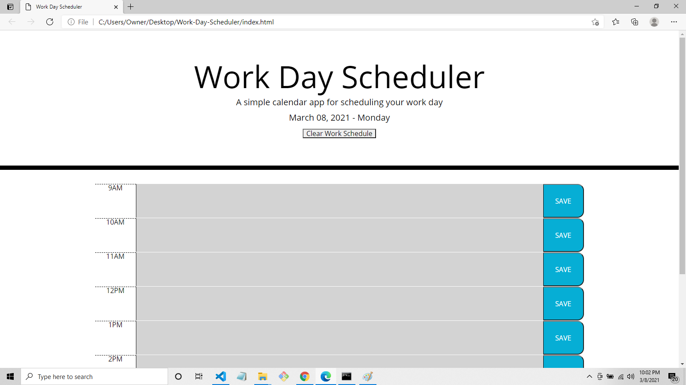

# Work-Day-Scheduler

This application is a useful day planner for scheduling a workday. When the planner is opened, the current date is displayed at the top of the calender. Each timeblock is color-coded (red for the current hour, gray for the past, green for the future). The user is able to type their scheduled tasks into the timeblocks and their tasks will be saved upon clicking the "Save" button. The user may also clear all the tasks by clicking the "Clear Work Schedule" button. For this project, I utilized Bootstrap, jQuery, and Moment.js. 

[Work Day Scheduler](https://fdwootton.github.io/Work-Day-Scheduler/)

